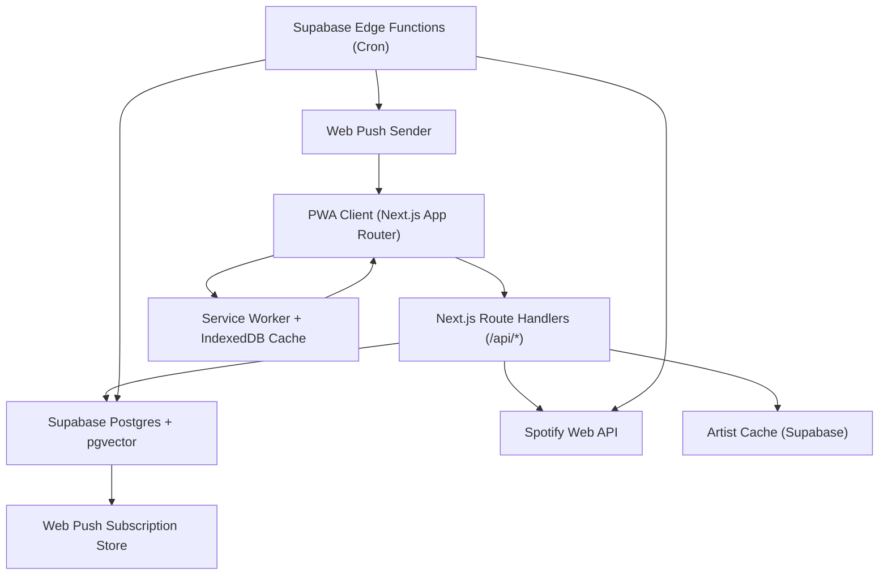

# Drift Engine PWA Implementation Plan (Decision-Complete)

## Summary
Build `Drift Engine` as a mobile-first PWA using Next.js 15 App Router, Supabase (Postgres + pgvector + Auth), Spotify Web API, and Supabase Edge Functions.
Chosen defaults from your input:
- Release: **Staged MVP**
- UI direction: **Editorial dark**
- Device priority: **Mobile-first PWA**

This plan defines architecture, schema, API contracts, modeling logic, UX/UI system, testing, rollout, and performance gates so implementation can start immediately without open decisions.

### Spotify API Compatibility (March 2026)
This plan is designed around the **post-February 2026** Spotify Web API surface. The following endpoints are confirmed unavailable for new (non-extended-quota) apps and are intentionally not used anywhere in this plan:
- `GET /audio-features`, `GET /audio-analysis` (deprecated Nov 2024)
- `GET /recommendations`, `GET /artists/{id}/related-artists` (deprecated Nov 2024)
- `GET /tracks?ids=`, `GET /artists?ids=` and all batch endpoints (removed Feb 2026)
- `GET /artists/{id}/top-tracks` (removed Feb 2026)
- 30-second preview URLs (removed Nov 2024)
- `popularity` field on tracks, artists, albums (removed Feb 2026)

**Endpoints this plan depends on (all confirmed available):**
| Endpoint | Purpose |
|---|---|
| `GET /me/top/tracks?time_range=...` | User's top tracks (short/medium/long term) |
| `GET /me/tracks` | User's saved library tracks |
| `GET /me` | User profile |
| `GET /tracks/{id}` | Individual track metadata |
| `GET /artists/{id}` | Individual artist metadata + genres |
| `GET /artists/{id}/albums` | Artist discography for candidate discovery |
| `GET /albums/{id}/tracks` | Album tracklist for candidate discovery |
| `GET /search?type=track` | Genre/artist-based candidate search (max 10/page) |
| `POST /me/playlists` | Create playlist |
| `POST /playlists/{id}/items` | Add tracks to playlist |

## Architecture Diagram (Text)



## Core Runtime Design
1. Client never sees Spotify tokens.
2. Route handlers use Supabase service role and user session context.
3. Scheduled jobs run in Edge Functions, **one user per invocation** to stay within the 150-second execution limit:
   - Weekly full recluster + radius tuning (invoked once per user by scheduler)
   - Daily candidate discovery and refresh (invoked once per user)
   - Token refresh pre-check (batch — lightweight, all users in one pass)
4. Exploration candidates are discovered via genre search + discography crawl, then scored and ranked server-side.
5. Artist metadata (especially genres) is aggressively cached in the `artists` table to minimize individual fetch overhead.
6. All Spotify API calls use exponential backoff with jitter (base 1s, max 32s) and respect 429 Retry-After headers.
7. Offline mode serves latest exploration queue and map snapshot from cache/IndexedDB.
8. Feedback events are queued offline and synced via Background Sync.

## Public APIs, Interfaces, and Types

### API contracts
| Route | Method | Request | Response | Auth |
|---|---|---|---|---|
| `/api/auth/spotify` | `GET` | `?action=login` or `?code=...` | redirect or `{connected:true}` | session |
| `/api/ingest` | `POST` | `{mode:"initial"\|"incremental"}` | `{jobId,status}` | session |
| `/api/clusters` | `GET` | none | `{globalCentroid,clusters,mapPoints}` | session |
| `/api/explore` | `POST` | `{clusterId?:string,limit?:number}` | `{candidates:[...]}` | session |
| `/api/feedback` | `POST` | `{candidateId,action:"like"\|"reject"\|"skip"}` | `{ok:true,clusterAdjustments}` | session |
| `/api/playlist/create` | `POST` | `{name,candidateIds:string[]}` | `{playlistId,spotifyUrl}` | session |
| `/api/push/subscribe` | `POST` | Push subscription JSON | `{ok:true}` | session |

### Shared TypeScript types
```ts
type FeedbackAction = "like" | "reject" | "skip";

interface ClusterDTO {
  id: string;
  clusterIndex: number;
  centroid: number[];
  variance: number;
  innerRadius: number;
  outerRadius: number;
  weight: number;
  acceptanceNear: number;
  acceptanceMid: number;
  acceptanceFar: number;
  topGenres: string[];
  topArtists: string[];
}

interface ExplorationCandidateDTO {
  id: string;
  clusterId: string;
  trackId: string;
  trackName: string;
  artistName: string;
  albumName: string;
  distance: number;
  sweetSpotScore: number;
  diversityScore: number;
  finalScore: number;
  rank: number;
  discoverySource: "genre_search" | "discography_crawl" | "seed_expansion";
}
```

## Genre Vocabulary (64 Super-Genres)

Spotify uses ~1,600+ freeform genre strings on artist profiles. This plan maps them to a fixed 64-dimension binary vector using keyword-based super-genre classification.

### Mapping strategy
1. Define 64 super-genre categories covering the full Spotify genre landscape.
2. Each Spotify genre string maps to 1–3 super-genres via keyword matching (e.g., "indie garage rock" → `indie`, `rock`, `garage`).
3. A track's genre vector = union of all its artists' mapped super-genres, binary 0/1.
4. The mapping table is stored as a static JSON artifact (`lib/model/genre-vocab.ts`) and versioned with the codebase.

### Super-genre categories (64)
```
pop, indie-pop, synth-pop, k-pop,
rock, alt-rock, indie-rock, punk, post-punk, metal, hard-rock, classic-rock,
hip-hop, trap, conscious-rap, drill,
r-and-b, neo-soul, soul, funk, motown,
electronic, house, techno, drum-and-bass, dubstep, ambient, idm, trance,
jazz, smooth-jazz, bebop, fusion,
classical, orchestral, chamber, opera,
folk, americana, singer-songwriter, acoustic,
country, bluegrass,
blues, delta-blues,
reggae, dancehall, afrobeats, afro-pop,
latin, reggaeton, bossa-nova, salsa,
world, middle-eastern, indian,
experimental, noise, avant-garde,
soundtrack, lo-fi, emo, grunge, shoegaze, new-wave
```

Unmapped Spotify genres fall through to the closest keyword match or remain unset (zero contribution). Tracks with zero genre signal are flagged for manual review and excluded from genre-based scoring.

## Embedding Design (Genre-Behavioral Hybrid, 67 Dimensions)

### Why not audio features
Spotify deprecated `GET /audio-features` (Nov 2024) and removed `popularity` from track/artist objects (Feb 2026). A new app cannot access these endpoints. This plan uses only data available from the current API surface.

### Embedding composition
| Dimensions | Source | Description |
|---|---|---|
| 64 | Artist genres via `GET /artists/{id}` | Binary super-genre vector (see Genre Vocabulary) |
| 1 | Track `release_date` from album | `release_year`: z-score normalized at runtime |
| 1 | Track `duration_ms` | `duration_ms`: z-score normalized at runtime |
| 1 | Track `explicit` flag | `explicit_val`: 0.0 or 1.0 |
| **67 total** | | |

### Storage vs. runtime assembly (two-layer architecture)
The embedding is split into a **stored layer** and a **runtime layer** to avoid a per-user normalization conflict:

- **Stored (per-track, in `track_features`):** `genre_vector(64)` + raw `release_year`, `duration_ms`, `explicit_val`. These are track-intrinsic and identical regardless of which user has the track. The `genre_vector` is indexed with ivfflat for fast similarity search during candidate discovery.
- **Assembled (per-user, at runtime):** The full 67-dim embedding is constructed during clustering and scoring by combining the stored genre vector with z-score normalized numeric features. Normalization stats (mean/std for release_year and duration_ms) are computed from the **current user's library** at the start of each clustering or scoring run.

This avoids a design flaw where two users sharing the same track would get conflicting stored embeddings. The genre vector (which dominates similarity) is precomputed and indexed; the numeric features are cheap to normalize on the fly.

### Normalization and scaling
The 67-dim vector is assembled as: `[genre_scaled..., year_norm, duration_norm, explicit_val]`

- **Genre dimensions (64):** binary 0/1, scaled by `0.5/sqrt(active_count)` where `active_count` is the number of active genre dims for that track (typically 3–6). This normalizes the genre sub-vector to a consistent magnitude (~0.5) regardless of how many genres are active, ensuring genre contributes roughly half the vector's total energy.
- **Numeric dimensions (2):** z-score normalized against the user's library, then scaled by `0.35` so each numeric dim contributes meaningfully but doesn't overpower genre. Combined numeric magnitude ≈ `0.35 * sqrt(2)` ≈ 0.49.
- **Explicit flag (1):** raw 0.0/1.0, scaled by `0.15`. Minor discriminator, low magnitude contribution.
- **Approximate magnitude budget:** genre ≈ 50%, numeric ≈ 45%, explicit ≈ 5%. Genre dominates cosine similarity as intended.

### Why this works
Genre is the primary axis of musical taste. The 64-dimension genre vector provides high-resolution clustering of taste profiles — a listener's affinity for "shoegaze + dream-pop + post-punk" vs "trap + conscious-rap + r-and-b" is well-separated in this space. Release year and duration add temporal and structural differentiation. The behavioral signals (source, rank) are used as **track weights during clustering** rather than embedding dimensions, keeping the embedding track-intrinsic and reusable across users.

### Track weighting in clustering
Tracks are weighted during k-means by their behavioral signal:
| Source | Weight |
|---|---|
| `top_short` | `1.5 + (1.0 - rank/50)` — recent favorites weighted highest |
| `top_medium` | `1.2 + (0.8 - rank/50)` |
| `top_long` | `1.0 + (0.6 - rank/50)` |
| `saved` | `0.8` — library tracks, lower individual signal |
| `explore` (liked) | `1.3` — validated discoveries |

This ensures clusters form around active taste, not just catalog breadth.

## Full SQL Schema (Core)

```sql
create extension if not exists vector;
create extension if not exists pgcrypto;

create type feedback_action as enum ('like', 'reject', 'skip');
create type candidate_status as enum ('pending', 'shown', 'liked', 'rejected', 'skipped', 'saved', 'expired');
create type discovery_source as enum ('genre_search', 'discography_crawl', 'seed_expansion');

create table public.users (
  id uuid primary key references auth.users(id) on delete cascade,
  spotify_user_id text unique not null,
  display_name text,
  norm_mean_year real,
  norm_std_year real,
  norm_mean_duration real,
  norm_std_duration real,
  last_cluster_at timestamptz,
  last_discovery_at timestamptz,
  created_at timestamptz not null default now(),
  updated_at timestamptz not null default now()
);

create table public.spotify_tokens (
  user_id uuid primary key references public.users(id) on delete cascade,
  access_token text not null,
  refresh_token text not null,
  expires_at timestamptz not null,
  scope text not null,
  token_type text not null default 'Bearer',
  updated_at timestamptz not null default now()
);

create table public.artists (
  spotify_artist_id text primary key,
  name text not null,
  genres text[] not null default '{}',
  image_url text,
  fetched_at timestamptz not null default now(),
  updated_at timestamptz not null default now()
);

create table public.tracks (
  spotify_track_id text primary key,
  name text not null,
  album_name text,
  album_id text,
  release_date date,
  release_year int,
  duration_ms int,
  explicit boolean not null default false,
  spotify_url text,
  updated_at timestamptz not null default now()
);

create table public.track_artists (
  spotify_track_id text not null references public.tracks(spotify_track_id) on delete cascade,
  spotify_artist_id text not null references public.artists(spotify_artist_id) on delete cascade,
  artist_order int not null,
  primary key (spotify_track_id, spotify_artist_id)
);

create table public.track_features (
  spotify_track_id text primary key references public.tracks(spotify_track_id) on delete cascade,
  release_year real not null,
  duration_ms real not null,
  explicit_val real not null default 0,
  genre_vector vector(64) not null,
  updated_at timestamptz not null default now()
);

create table public.user_tracks (
  id bigserial primary key,
  user_id uuid not null references public.users(id) on delete cascade,
  spotify_track_id text not null references public.tracks(spotify_track_id) on delete cascade,
  source text not null check (source in ('top_short', 'top_medium', 'top_long', 'saved', 'explore')),
  time_range text not null default '',
  rank_position int,
  added_at timestamptz,
  is_saved boolean not null default false,
  created_at timestamptz not null default now(),
  unique (user_id, spotify_track_id, source, time_range)
);

create table public.clusters (
  id uuid primary key default gen_random_uuid(),
  user_id uuid not null references public.users(id) on delete cascade,
  cluster_index int not null,
  centroid vector(67) not null,
  genre_profile vector(64),
  top_genres text[] not null default '{}',
  variance real not null,
  track_count int not null,
  inner_radius real not null,
  outer_radius real not null,
  weight real not null default 1.0,
  acceptance_near real not null default 0.5,
  acceptance_mid real not null default 0.5,
  acceptance_far real not null default 0.5,
  created_at timestamptz not null default now(),
  updated_at timestamptz not null default now(),
  unique (user_id, cluster_index)
);

create table public.cluster_tracks (
  cluster_id uuid not null references public.clusters(id) on delete cascade,
  spotify_track_id text not null references public.tracks(spotify_track_id) on delete cascade,
  distance real not null,
  primary key (cluster_id, spotify_track_id)
);

create table public.exploration_candidates (
  id uuid primary key default gen_random_uuid(),
  user_id uuid not null references public.users(id) on delete cascade,
  cluster_id uuid not null references public.clusters(id) on delete cascade,
  spotify_track_id text not null references public.tracks(spotify_track_id) on delete cascade,
  distance real not null,
  sweet_spot_score real not null,
  diversity_score real not null,
  final_score real not null,
  rank int not null,
  source discovery_source not null default 'genre_search',
  status candidate_status not null default 'pending',
  generated_at timestamptz not null default now(),
  shown_at timestamptz,
  acted_at timestamptz
);

create table public.feedback (
  id bigserial primary key,
  user_id uuid not null references public.users(id) on delete cascade,
  candidate_id uuid not null references public.exploration_candidates(id) on delete cascade,
  cluster_id uuid not null references public.clusters(id) on delete cascade,
  spotify_track_id text not null references public.tracks(spotify_track_id) on delete cascade,
  action feedback_action not null,
  distance real not null,
  relative_distance real not null,
  created_at timestamptz not null default now()
);

create table public.pwa_subscriptions (
  id uuid primary key default gen_random_uuid(),
  user_id uuid not null references public.users(id) on delete cascade,
  endpoint text not null unique,
  p256dh text not null,
  auth text not null,
  user_agent text,
  created_at timestamptz not null default now(),
  last_notified_at timestamptz
);

-- Indexes
create index idx_user_tracks_user on public.user_tracks(user_id, created_at desc);
create index idx_clusters_user on public.clusters(user_id, cluster_index);
create index idx_cluster_tracks_cluster on public.cluster_tracks(cluster_id, distance);
create index idx_candidates_user_status on public.exploration_candidates(user_id, status, generated_at desc);
create index idx_feedback_user_cluster on public.feedback(user_id, cluster_id, created_at desc);
create index idx_artists_fetched on public.artists(fetched_at);
-- NOTE: Create ivfflat index AFTER initial data load for effective list distribution
-- create index idx_track_features_genre on public.track_features using ivfflat (genre_vector vector_cosine_ops) with (lists = 100);

-- Row Level Security
alter table public.users enable row level security;
alter table public.spotify_tokens enable row level security;
alter table public.user_tracks enable row level security;
alter table public.clusters enable row level security;
alter table public.cluster_tracks enable row level security;
alter table public.exploration_candidates enable row level security;
alter table public.feedback enable row level security;
alter table public.pwa_subscriptions enable row level security;

create policy "Users read own row" on public.users for select using (auth.uid() = id);
create policy "Users update own row" on public.users for update using (auth.uid() = id);

create policy "Tokens owner only" on public.spotify_tokens for all using (auth.uid() = user_id);

create policy "User tracks owner read" on public.user_tracks for select using (auth.uid() = user_id);
create policy "User tracks owner write" on public.user_tracks for insert with check (auth.uid() = user_id);

create policy "Clusters owner only" on public.clusters for select using (auth.uid() = user_id);
create policy "Cluster tracks via cluster owner" on public.cluster_tracks for select
  using (exists (select 1 from public.clusters c where c.id = cluster_id and c.user_id = auth.uid()));

create policy "Candidates owner only" on public.exploration_candidates for select using (auth.uid() = user_id);

create policy "Feedback owner read" on public.feedback for select using (auth.uid() = user_id);
create policy "Feedback owner write" on public.feedback for insert with check (auth.uid() = user_id);

create policy "Push subs owner only" on public.pwa_subscriptions for all using (auth.uid() = user_id);

-- Artists and tracks are shared catalog data, read-only for authenticated users
alter table public.artists enable row level security;
alter table public.tracks enable row level security;
alter table public.track_artists enable row level security;
alter table public.track_features enable row level security;

create policy "Artists readable by authenticated" on public.artists for select using (auth.role() = 'authenticated');
create policy "Tracks readable by authenticated" on public.tracks for select using (auth.role() = 'authenticated');
create policy "Track artists readable by authenticated" on public.track_artists for select using (auth.role() = 'authenticated');
create policy "Track features readable by authenticated" on public.track_features for select using (auth.role() = 'authenticated');
```

## Clustering Pseudocode

```text
function runClustering(userId, k = 6):
  // 1. Load raw features + behavioral data
  rows = load (genre_vector, release_year, duration_ms, explicit_val, source, rank_position)
         for userId from user_tracks join track_features
  W = [computeWeight(row.source, row.rank_position) for row in rows]

  // 2. Compute per-user normalization stats from this library
  meanYear = mean([r.release_year for r in rows])
  stdYear  = std([r.release_year for r in rows])  // clamp min 1.0
  meanDur  = mean([r.duration_ms for r in rows])
  stdDur   = std([r.duration_ms for r in rows])    // clamp min 1.0

  // 3. Assemble 67-dim vectors at runtime
  V = []
  for each row r in rows:
    activeCount = count(nonzero(r.genre_vector))
    genreScaled = r.genre_vector * (0.5 / sqrt(max(activeCount, 1)))
    yearNorm    = 0.35 * (r.release_year - meanYear) / stdYear
    durNorm     = 0.35 * (r.duration_ms - meanDur) / stdDur
    explicitVal = 0.15 * r.explicit_val
    V.push(concat(genreScaled, yearNorm, durNorm, explicitVal))

  if |V| < k: k = max(2, floor(|V| / 2))

  globalCentroid = weightedMean(V, W)

  // 4. Weighted k-means
  centroids = kmeansPlusPlusInit(V, k)
  repeat max 25 iterations:
    assignments = assignEachVectorToNearestCentroid(V, centroids, cosineDistance)
    newCentroids = weightedRecomputeCentroids(V, W, assignments, k)
    shift = maxDistance(centroids, newCentroids)
    centroids = newCentroids
    if shift < 1e-4: break

  // 5. Compute cluster statistics
  for each cluster c in 0..k-1:
    D = distances of members to centroid[c]
    variance = weightedMean(square(D), W[members])
    innerRadius = weightedPercentile(D, W[members], 35)
    outerRadius = weightedPercentile(D, W[members], 80)
    genreProfile = mean(genre_vectors of members)  // unscaled, for search queries
    topGenres = top 5 genres from genreProfile by magnitude

  // 6. Persist (centroids are stored as 67-dim assembled vectors)
  transaction:
    upsert clusters + global centroid + genre profiles
    store normalization stats (meanYear, stdYear, meanDur, stdDur) on user record
    replace cluster_tracks membership rows
```

## Candidate Discovery Pipeline

Without Spotify's `/recommendations` or `/related-artists` endpoints, candidate discovery uses three strategies in parallel:

### Strategy 1: Genre-based search
For each cluster, extract top 5 genres from `genre_profile`. Construct Spotify search queries using a tiered approach:

**Primary (structured filter):**
- `genre:"indie rock" year:2020-2026`
- `genre:"dream pop" year:2018-2026`
- Vary year ranges to balance recency and catalog depth.

**Fallback (free-text, if `genre:` filter returns <3 results):**
Spotify's `genre:` search filter has inconsistent coverage. When a genre query returns fewer than 3 results, fall back to free-text search combining genre keywords with representative artist names from the cluster:
- `"indie rock" 2024` (genre as free text)
- `artist:"Slowdive" OR artist:"Beach House"` (top artists from cluster)
- `"dream pop" new` (genre + recency keyword)

The fallback queries are less precise but maintain candidate yield. Issue 3–5 search queries per cluster (10 results each = 30–50 raw candidates per cluster). Track which query strategy produced each candidate for quality monitoring.

### Strategy 2: Discography crawl
For each cluster, identify 3–5 representative artists near the cluster boundary (distance between inner and outer radius):
- Fetch `GET /artists/{id}/albums?include_groups=album,single` for each.
- Fetch `GET /albums/{id}/tracks` for recent albums (last 5 years).
- Filter out tracks the user already has in `user_tracks`.
- Yields deep-catalog candidates the user likely hasn't encountered.

### Strategy 3: Seed expansion (feedback-driven)
When a user "likes" a candidate, that candidate's artists become seeds for the next discovery run. Seed artists are **derived at query time** from the feedback table — no separate queue table is needed:
```sql
SELECT DISTINCT ta.spotify_artist_id
FROM feedback f
JOIN exploration_candidates ec ON ec.id = f.candidate_id
JOIN track_artists ta ON ta.spotify_track_id = ec.spotify_track_id
WHERE f.user_id = $1
  AND f.action = 'like'
  AND f.created_at > $2  -- last discovery run timestamp
```
For each seed artist, run the Strategy 2 discography crawl flow. This creates a positive feedback loop: good discoveries lead to more candidates from the same artistic neighborhood.

### Rate-limit budget per discovery run
| Operation | Calls | Notes |
|---|---|---|
| Genre search (primary + fallback) | 6 clusters × 5 queries = 30 | Extra query for fallback on low-yield clusters |
| Artist discography | 6 clusters × 4 artists × 2 calls = 48 | albums + tracks |
| Seed expansion discography | ~6 seed artists × 2 calls = 12 | From liked candidates |
| Artist metadata (cache miss) | ~20 new artists | Most already cached |
| **Total per run** | **~110 requests** | Well within 180 req/30s |

### Post-discovery processing
1. For each discovered track, check if artist genres are cached in `artists` table.
2. Fetch uncached artists individually via `GET /artists/{id}`, update cache.
3. Compute genre vector from artist genres using the 64 super-genre vocabulary. Store raw features in `track_features`.
4. **Initial filter:** Use ivfflat index on `genre_vector(64)` to check cosine similarity against cluster `genre_profile`. Discard tracks with genre similarity < 0.1 (completely unrelated).
5. **Full scoring:** For shortlisted candidates, assemble the full 67-dim embedding at runtime using the user's normalization stats (stored during last clustering run). Score against the 67-dim cluster centroid using the exploration formula.
6. Persist top N candidates per cluster to `exploration_candidates`.

## Exploration Scoring Formula
For each candidate track `t` scored against cluster `c`, the full 67-dim embedding for `t` is assembled at runtime using the user's stored normalization stats (see Clustering Pseudocode step 2–3). Distance `d(t,c)` is cosine distance between this assembled vector and the cluster's stored 67-dim centroid.
- Filter: `inner_radius_c < d(t,c) < outer_radius_c`
- `sweet_spot = exp(-((d - mu_c)^2 / (2 * sigma_c^2)))`, where `mu_c = inner + 0.62*(outer-inner)`, `sigma_c = 0.18*(outer-inner)`
- `artist_novelty = 1 - min(existing_artist_count/3, 1)`
- `genre_novelty = 1 - cosine(genre_vec_t, cluster_genre_profile_c)`
- `diversity = 0.6*artist_novelty + 0.4*genre_novelty`
- `final_score = 0.55*sweet_spot + 0.30*diversity + 0.15*cluster_weight_c*acceptance_region_bias`
- Sort descending by `final_score`, keep top N per cluster.

## Feedback Update Logic
1. On `like|reject|skip`, compute `relative_distance = (d-inner)/(outer-inner)`.
2. Map region:
   - `near` if `<0.33`
   - `mid` if `0.33..0.66`
   - `far` if `>0.66`
3. Update acceptance bias by EWMA:
   - `bias_new = (1-lr)*bias_old + lr*signal`
   - `signal = 1.0` for like, `0.0` for reject, `0.35` for skip
   - `lr = 0.08`
4. Update cluster weight:
   - `weight_new = clamp(weight_old + 0.05*(2*signal-1), 0.2, 3.0)`
5. Seed expansion trigger:
   - On `like`, the candidate's artists are automatically picked up by the next discovery run via derived query (see Candidate Discovery Pipeline, Strategy 3). No separate queue storage needed — the `feedback` table with `action='like'` + `created_at` serves as the implicit queue.
6. Radius tuning weekly:
   - Increase outer radius by 5% if far-region like rate > 0.60
   - Decrease outer radius by 5% if far-region reject rate > 0.55
   - Increase inner radius by 3% if near-region reject rate > 0.60
   - Clamp `inner < outer` and min gap `>= 0.08`.

## Taste Map 2D Projection

The home screen's Taste Map renders clusters and candidates on a 2D canvas. The projection uses PCA:

1. **Assemble**: Load raw features from `track_features`, assemble 67-dim vectors using the user's stored normalization stats (same runtime assembly as clustering).
2. **Compute**: Run PCA on the assembled 67-dim vectors → 2-dim, retaining the top 2 principal components. This is computed on-the-fly — 67-dim PCA on <5k vectors is <50ms in JS, no caching table needed.
3. **Project**: Map cluster centroids (stored as 67-dim), cluster member tracks, and exploration candidates into the same 2D space using the fitted projection matrix.
4. **Recompute**: On weekly recluster, PCA is refit automatically since normalization stats and centroids update.
5. **Client rendering**: Canvas/WebGL with cluster regions as colored convex hulls, tracks as dots, candidates as highlighted rings at their projected positions.

## UI/UX Design Blueprint (Editorial Dark, Mobile-First)

### Visual system
- Typography:
  - Display: `Fraunces`
  - Body/UI: `IBM Plex Sans`
  - Data labels: `IBM Plex Mono`
- Color tokens:
  - `--bg-0: #0b0f12`
  - `--bg-1: #121820`
  - `--surface: #18212b`
  - `--text-0: #eef3f7`
  - `--text-1: #9fb0c2`
  - `--accent-a: #11bfae`
  - `--accent-b: #f3b846`
  - `--accent-c: #ff6b5a`
  - `--grid-line: rgba(255,255,255,0.08)`
- Style language: high-contrast cards, thin chart lines, subtle grain, glow only on active states.

### Information architecture
1. `Onboarding`: Spotify connect, permission explanation, first sync status.
2. `Home / Taste Map`: 2D PCA map with clusters and candidate overlay.
3. `Explore Queue`: swipe-card + quick actions (Like/Reject/Skip).
4. `Cluster Detail`: top genres, top artists, accepted/rejected bands, seed artist/genre controls.
5. `History`: feedback timeline and saved discoveries.
6. `Settings`: sync status, push subscription, offline cache controls.

### Interaction design
- Primary thumb zone actions at bottom sheet on mobile.
- Card action latency target `<100ms` optimistic UI.
- Progressive disclosure:
  - Default: simple "Why this track?" explanation showing genre overlap and distance
  - Tap for full genre-vector breakdown and cluster context
- Motion:
  - Initial map load staggered by cluster
  - Candidate card transitions 180–220ms
  - No continuous heavy animations during interaction

### Accessibility
- WCAG AA contrast baseline.
- Full keyboard support on desktop.
- Screen-reader labels for map points and actions.
- Reduced-motion variant for map transitions.

## File Structure (Target)

```text
/Users/sarthak/Public/drift-engine
  app/
    (auth)/connect/page.tsx
    (app)/page.tsx
    (app)/explore/page.tsx
    (app)/clusters/[id]/page.tsx
    (app)/history/page.tsx
    api/auth/spotify/route.ts
    api/ingest/route.ts
    api/clusters/route.ts
    api/explore/route.ts
    api/feedback/route.ts
    api/playlist/create/route.ts
    api/push/subscribe/route.ts
  components/
    map/TasteMapCanvas.tsx
    explore/CandidateCard.tsx
    explore/FeedbackActions.tsx
    clusters/ClusterStats.tsx
    ui/*
  lib/
    spotify/client.ts
    spotify/token-refresh.ts
    spotify/rate-limiter.ts
    ingest/pipeline.ts
    ingest/artist-cache.ts
    model/normalize.ts
    model/kmeans.ts
    model/pca.ts
    model/genre-vocab.ts
    explore/scoring.ts
    explore/discovery.ts
    explore/genre-search.ts
    explore/discography-crawl.ts
    feedback/update.ts
    pwa/sw-register.ts
    supabase/server.ts
    supabase/service.ts
  supabase/
    migrations/001_initial_schema.sql
    migrations/002_ivfflat_index.sql
    functions/weekly-cluster/index.ts
    functions/daily-explore/index.ts
    functions/push-notify/index.ts
  public/
    manifest.webmanifest
    icons/*
    sw.js
  tests/
    unit/*
    integration/*
    e2e/*
```

## Step-by-Step Roadmap

### 1. Scaffold and Infra
- Initialize Next.js 15 + Tailwind + Supabase clients.
- Add env schema validation (zod).
- Add manifest + service worker skeleton.
- Define genre vocabulary in `lib/model/genre-vocab.ts`.
- Acceptance: app boots, PWA install prompt appears on supported devices.

### 2. Auth and Token Lifecycle
- Implement `/api/auth/spotify` login/callback using Supabase Auth + Spotify OAuth.
- Persist tokens and Spotify user ID.
- Add token refresh utility and expiry guard middleware.
- Acceptance: reconnect-free usage over token expiry boundaries.

### 3. Data Ingestion Pipeline
- Implement initial and incremental ingestion flows:
  - Fetch `GET /me/top/tracks` for short/medium/long term (50 each, 150 max).
  - Paginate `GET /me/tracks` for saved library tracks.
  - For each unique artist, check `artists` cache table; fetch uncached artists via individual `GET /artists/{id}` calls.
- Build genre vectors using the 64 super-genre vocabulary mapping.
- Store raw features (release_year, duration_ms, explicit_val) + precomputed genre_vector in `track_features`. No pre-normalized embedding — normalization happens at runtime during clustering/scoring.
- Rate limiting: exponential backoff with jitter, respect 429 Retry-After.
- Acceptance: account with 500 saved tracks + top tracks ingests reliably in <3 minutes with retries.

### 4. Modeling and Exploration Core
- Implement weighted k-means clustering with cosine distance.
- Implement PCA projection (67-dim → 2-dim) for taste map.
- Implement candidate discovery pipeline (genre search + discography crawl).
- Implement exploration scoring formula.
- Persist candidate queue per cluster.
- Acceptance: candidate generation <500ms per cluster after prefetch; discovery run completes within rate-limit budget.

### 5. Feedback Learning
- Implement feedback endpoint and adaptive parameter updates (EWMA bias, weight, seed expansion).
- Reflect updated tuning in subsequent exploration runs.
- Acceptance: measurable score shifts after user feedback events.

### 6. Visualization and UX
- Build mobile-first Taste Map (PCA 2D canvas), Explore Queue, Cluster Detail, History.
- Add "Why this track?" explanation panels showing genre overlap.
- Acceptance: key user loop finished within 3 taps from home.

### 7. PWA Offline + Push
- Cache shell + latest exploration queue.
- Queue offline feedback, sync on reconnect.
- Implement push subscription + weekly playlist-ready notification.
- Acceptance: offline explore + deferred feedback works; push delivered.

### 8. Hardening, Perf, Deploy
- Create ivfflat index on `genre_vector(64)` after initial data load (`migrations/002_ivfflat_index.sql`).
- Add full test suite and error observability.
- Configure Vercel + Supabase cron jobs + secrets.
- Acceptance: meets performance constraints and production readiness checklist.

### Dev-mode constraints (5-user limit)
Spotify's Feb 2026 policy limits new apps to 1 Client ID and 5 users in development mode. The MVP roadmap (Steps 1–6) is designed to validate with 5 users. Apply for extended quota after demonstrating the feedback learning loop works (Step 5 complete). If extended quota is denied, the app remains functional for the 5-user cohort — no architectural changes needed, only a business constraint on growth.

## Test Cases and Scenarios

1. Auth callback handles first-time login, token refresh, and revoked token.
2. Ingestion handles pagination, partial failures, rate-limit 429 retries, and idempotent upserts.
3. Artist cache avoids redundant fetches; cache hit rate >80% after initial ingest.
4. Genre vocabulary maps common Spotify genres correctly (unit test with 50+ known genre strings).
5. Runtime embedding assembly produces correct 67-dim vectors for known inputs with given normalization stats.
6. Clustering produces stable output for fixed seed and respects `k<=track_count`.
7. Track weighting by source/rank produces expected cluster shape differences.
8. Discovery pipeline respects rate-limit budget and deduplicates against user library.
9. Exploration excludes saved tracks and overrepresented artists (`>3` tracks).
10. Feedback updates cluster biases correctly per action and distance region.
11. Seed expansion derived query correctly returns artists from liked candidates since last discovery run.
12. Playlist creation succeeds only for valid pending/liked candidates (max 100 tracks per Spotify API call).
13. Offline mode serves last cached queue and syncs queued feedback later.
14. Push notification sent only when fresh candidates or playlist exists.
15. Performance:
    - Clustering under 1s for 5k vectors on target compute profile.
    - Exploration ranking under 500ms per cluster.
    - PCA projection under 50ms for 5k vectors.
16. Security:
    - Tokens never returned in client responses.
    - RLS prevents cross-user reads/writes (tested per policy).

## Deployment and Ops Plan
- Supabase:
  - Enable `pgvector`
  - Apply migrations (schema first, ivfflat index after data load)
  - RLS policies included in migration (not bolted on separately)
  - Configure service-role usage for server routes/functions
- Vercel:
  - Set env vars for Supabase, Spotify, VAPID, cron secrets
  - Enable scheduled triggers hitting secured Edge Function endpoints
- Required env:
  - `NEXT_PUBLIC_SUPABASE_URL`
  - `NEXT_PUBLIC_SUPABASE_ANON_KEY`
  - `SUPABASE_SERVICE_ROLE_KEY`
  - `SPOTIFY_CLIENT_ID`
  - `SPOTIFY_CLIENT_SECRET`
  - `SPOTIFY_REDIRECT_URI`
  - `VAPID_PUBLIC_KEY`
  - `VAPID_PRIVATE_KEY`
  - `CRON_SHARED_SECRET`

## Future Improvements
1. Session-based contextual recommendations (time-of-day/activity).
2. Multi-objective ranking with explicit novelty slider.
3. Third-party audio analysis integration (Cyanite, Essentia) to restore audio-feature dimensions if valuable.
4. Hybrid ANN retrieval against larger external catalog vectors.
5. Explainability cards with genre-attribution breakdowns.
6. Collaborative taste blending for shared playlists.
7. On-device lightweight embeddings for faster offline ranking.
8. Restore audio features if Spotify reopens access or via extended quota approval.

## Assumptions and Defaults
- Start from an empty repository at `/Users/sarthak/Public/drift-engine`.
- Genre embedding uses fixed 64 super-genre vocabulary; total assembled vector dimension is 67.
- `track_features` stores raw features + precomputed genre_vector(64). The full 67-dim embedding is assembled at runtime using per-user normalization stats, avoiding cross-user normalization conflicts.
- The ivfflat index operates on the 64-dim genre_vector for candidate similarity search. Full 67-dim scoring is done in-memory after shortlisting.
- Behavioral signals (source, rank) are applied as track weights during clustering, not as embedding dimensions.
- Weekly full recluster cadence is sufficient for drift control.
- Candidate discovery uses genre search (with free-text fallback) + discography crawl + feedback-driven seed expansion; no Spotify recommendations endpoint.
- Seed expansion is derived from the feedback table at query time, not stored in a separate queue.
- Artist metadata is aggressively cached; cache staleness threshold is 30 days before re-fetch.
- Supabase Auth is used for app identity; Spotify OAuth is linked and stored server-side.
- All Spotify API calls respect rate limits with exponential backoff + jitter.
- Edge Functions process one user per invocation to stay within the 150-second execution limit.
- New Spotify apps are limited to 1 Client ID and 5 users in dev mode (Feb 2026 policy); plan for extended quota application after Step 5 (feedback learning) is validated.
